# 최종 프로젝트

## 프로젝트 개요

### 접근 순서

1. 사이트 설명 및 로그인페이지(토큰 있으면 페이지 넘김)
   1. 로그인페이지에 회원가입 폼 혹은 회원가입 폼, 로그인 폼 같이
2. 영화정보 페이지
   1. 개별 영화 클릭시 해당 정보 나옴
   2. 리뷰-> 한줄 리뷰 or 게시글
3. 영화 추천 페이지
   1. 현재 인기있는 영화
   2. 최근 몇시간 동안 리뷰가 많이 적힌 영화
   3. 그 외 개인 추천?
4. 개인 페이지 
   1. 좋아요 누른 영화
   2. 리뷰 작성한 영화
   3. 본 영화?
5. 디자인

### 필요한 기능

- 로그인, 회원가입
- 전체 영화리스트 / 영화 정보 
- 영화 리뷰 
  - 게시글(crud)
- 개인 페이지/ admin
- 영화 추천 알고리즘
- 주말 오후 (CSS)

### 컴포넌트(프론트엔드) / 파일 구조

로그인

회원가입

메인 페이지(영화 리스트) -> card: 컴포넌트

community(리뷰 페이지) -> 각 리뷰: 컴포넌트

개인 페이지(profile)

- 팔로우 X

추천 페이지: 메인이랑 비슷하게(card 컴포넌트 사용)

- netflix 같이 


### 데이터모델링 (백엔드)

User 

- Review(1 : N)
- 추천(1:1)
- Review Comment (1:N)
- 좋아요(1:N)?

Review(Article)

- comment (M:N)

Movie <- json 형식?

- 굳이 모델 안만들고 axios요청으로 받아옴
- 추천 알고리즘 때 다시 생각해볼것


## Signup, Login, Logout

### 0. 준비

django

파이썬 3.8 가상환경  

django -> 장고 서버

django rest framework -> api 사용

django restframework jwt -> 토큰 기반 로그인 사용


vue

vue/cli: bable, webpack 사용

vue router: single page applcation에서 라우팅 가능하게 사용

vuex: 상태관리 

axios 설치 `npm install --save axios`


### 1. Server(Django)

1. account 앱 설정

2. 커스텀 유저 모델 및 Serializer 생성
   
   - Abstarct User 사용 -> username, password 기본값
   
3. Singup
   - username, password, passwordconfirmation 을 받음
   
   - password, passwordConfirmation 두개가 다르면 에러 반환
   
   - 유효성 검사를 넘기면 비밀번호를 암호화하여 저장(회원가입 성공)
   
   - 결과
   
       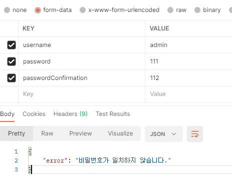
   
       
   
4. Login

   - 토큰 (restframework jwt) 를 사용하여 로그인 여부 확인
   - ` JWT_EXPIRATION_DELTA': datetime.timedelta(days=1),`: 개발단계니까 길게 설정


### 2. Client(vue)

1. vue로 client 생성
2. signup
   1. 회원가입 폼 작성
   2. 회원가입 버튼을 눌렀을때 django 서버에 요청을 보내 연결해서 만들어지는지 확인
      1. axois를 전역에서 사용하기위해 main.js에 임포트
      2.  `CORS_ALLOW_ALL_ORIGINS = True`
   3. 정상적인 응답을 받으면 로그인페이지로 이동
3. login
   1. 로그인 폼 작성
   2. 서버에서 토큰 생성해서 보내줌
   3. 응답을 받으면 브라우저(로컬저장소)에 토큰 저장  
   4. 로그인되면 signup, login 안보이게 설정
4. Logout 
   1. 토큰 삭제


##  영화 데이터 출력

### 0. 준비

1. 영화 데이터 TMDB 가져오기

    - python을 사용하여 tmdb에 요청하고 받은 응답을 json 형식으로 만들기

    ```python
    # tmdb.py
    import requests
    
    class URLMaker:    
        url = 'https://api.themoviedb.org/3'
    
        def __init__(self, key):
            self.key = key
    
        def get_url(self, category='movie', feature='popular', **kwargs):
            url = f'{self.url}/{category}/{feature}'
            url += f'?api_key={self.key}'
    
            for k, v in kwargs.items():
                url += f'&{k}={v}'
            return url
    
        def movie_id(self, title):
            url = self.get_url('search', 'movie', region='KR', language='ko', query=title)
            res = requests.get(url)
            movie = res.json()
    
            if len(movie.get('results')):
                return movie.get('results')[0].get('id')
            else:
                return None
    ```
    2
    ```python
        import requests
        from tmdb import URLMaker
        import json
        from pprint import pprint
        from collections import OrderedDict
    
        # 특정 조건에 맞는 영화 출력
    
        def vote_average_movies():
            API_KEY = '62a02e776e4bd0a23d54988aadcfde01'
            maker = URLMaker(API_KEY) 	# API_KEY를 가진 인스턴스 생성
            url = maker.get_url()		# 영화 리스트 조회 URL을 생성, 
                                        # 기본값 category='movie', feature='popular'
            url += '&language=ko-KR'
            result = []                 # 반환할 값
            id_cnt = 1
            for i in range(1,6):
                url += '&page=' + str(i)
                res = requests.get(url)		# requests 패키지를 이용하여 URL에 요청을 보냄
                movie_dict = res.json()		# 응답 받은 데이터를 json으로 변환
                movie_list= movie_dict.get('results')
                                            # 응답받는 데이터에서 'results' 값을 가져옴
    
                for movie in movie_list:    
                    mov = OrderedDict()
                    mov["model"] = "movies.movie"
                    mov["pk"] = id_cnt
                    fields = OrderedDict()
                    tmp = movie.get('genre_ids')
                    tmp_string = ''
                    for i in range(len(tmp)): 
                        tmp_string += str(tmp[i])+','
                    fields['genre_ids'] = tmp_string
                    fields['movie_id'] = movie.get('id')
                    fields['overview'] = movie.get('overview')
                    fields['poster_path'] = movie.get('poster_path')
                    fields['release_date'] = movie.get('release_date')
                    fields['title'] = movie.get('title')
                    fields['vote_average'] = movie.get('vote_average')
                    mov["fields"] = fields
                    result.append(mov)        # 이상이면 result에 추가
                    id_cnt += 1
            print(result)
    
            with open("./movies.json", "w", encoding="utf-8") as outfile:
                json.dump(result, outfile, ensure_ascii=False, indent="\t")
            return result
    
        if __name__ == '__main__':
            vote_average_movies()
    ```

    - genre_ids가 list로 받아지는데 얘를 django model에서 선언하기 어려웠음
    
    - 문자열로 만들어서 값을 넣어줌


​      

2. Json 형식으로 변환하여 DB에 저장

    - `python manage.py loaddata movies`


### 1.  Server(Django)

API 서버 제작

1. Movies app 으로 요청이 들어오면 DB에 있는 데이터 전체 전송
    - serializer를 사용하여 모든 데이터 전송


### 2. Client(vue)

1. 데이터가 없는경우 서버에 데이터 요청
   1. 서버를 처음 구동할때는 vue에 데이터가 없으므로 최소 한번 요청함
   2. 계속 받아오는 것으로 하였으나 중복된 데이터를 계속 쌓아서 데이터가 없을때만 요청함
   
2. bootstrap을 사용하여 화면 구성

    1. Card를 사용하여 반응형 페이지 제작

        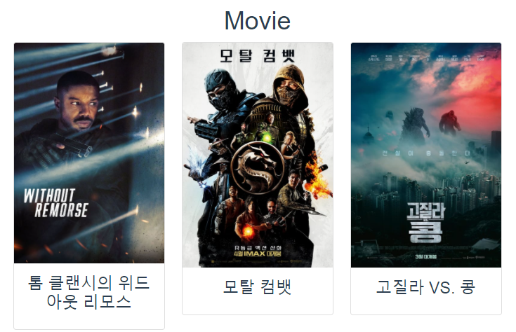

    2. 클릭시 상세 페이지 팝업(bootstrap Modal 사용)

        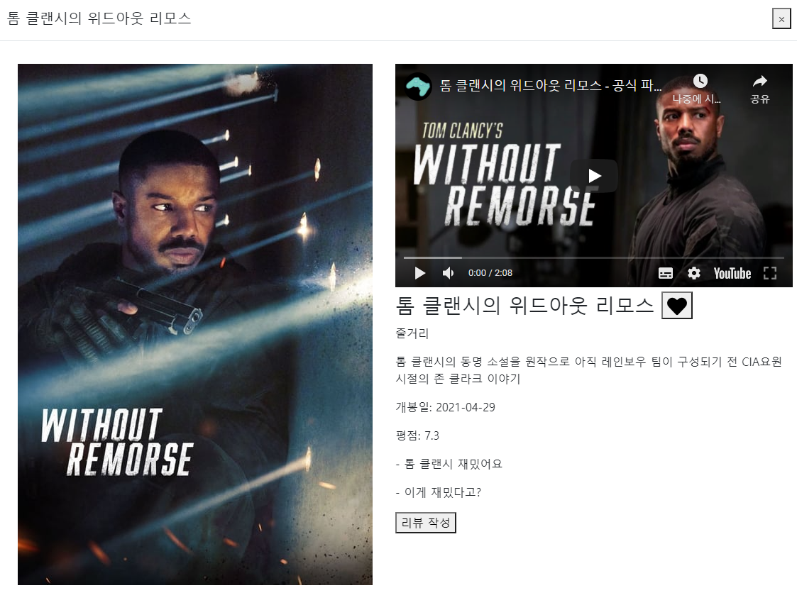

        1. 유튜브 플레이어(트레일러 영상)
           1. 영상 크기맞추는게 어려움
           2. 팝업이 띄워지면 axios 요청
              1. click 이벤트로 구현
              2. get videos의 값에 trailer가 있으면 그 값을 넣고 없으면 제일 처음값
              3. iframe -> 유튜브 임베드 trailer 키값을 넣어주면 재생
              4. 영상이 없는 영화도 있음 -> 유튜브 검색 api사용할 지 고민중
        2. 리뷰
           1. 제목만 출력
           2. 리뷰작성 버튼 클릭시 페이지 넘어감
        3. 좋아요 버튼
           1. API와 연동하여 좋아요 구현
    
3. 문제점

   1. 반응형으로 줄어들때 Modal 내부 조정 필요함 - 내부도 같이 줄어야하는데 아직 안됨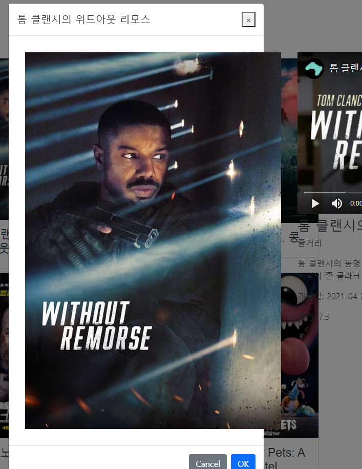


## 리뷰 게시판

### 1. Server(Django)

1. review app 사용

2. RESTFul API

   ```python
   urlpatterns = [ # 127.0.0.1:8000/review/
       path('', views.review_list),
       path('<int:movie_id>/', views.review_detail_create),
       path('<int:movie_id>/<int:review_id>/', views.review_update_delete),
       path('comment/<int:review_id>/', views.comment_list_create),
       path('comment/<int:review_id>/<int:comment_id>/', views.comment_update_delete),
   ]
   ```

   1. 전체 리뷰 조회
   2. 리뷰 상세 조회 및 생성
   3. 리뷰 수정 및 삭제
   4. 댓글 조회 및 생성
   5. 댓글 수정 및 삭제

3. 수정, 삭제시 리뷰 작성자 혹은 댓글 작성자와 로그인한 유저가 같지 않을 경우 에러 반환

   ```python
   if author != request.user:
       return Response({'data':'글쓴이가 다릅니다'}, status=status.HTTP_403_FORBIDDEN)
   ```

   

### 2. Client(vue)

1.  리뷰게시판 (community)

2. 전체 리뷰 출력

    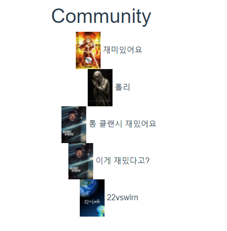

3. 리뷰 상세 페이지

    - 리뷰 상세 내용 출력

    - 본인 리뷰만 수정, 삭제 가능

      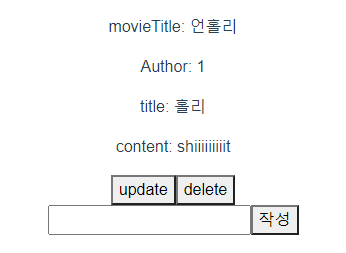

    - 댓글 기능 (본인 댓글만 수정,삭제 가능)

      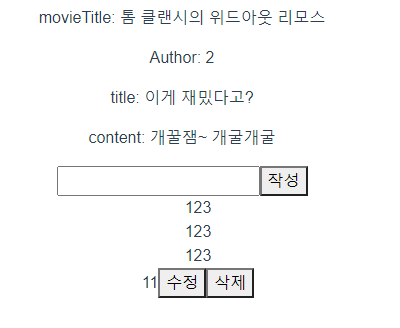

      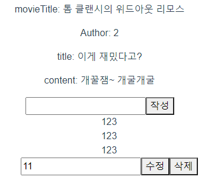


##  Mypage

### 1. Server

```python
def profile(request):
    user = request.user
    reviews = user.review_set.all()
    reviewSerializer = ReviewSerializer(reviews, many=True)
    like_movies = user.like_movies.all()
    movieSerializer = MovieSerializer(like_movies, many=True)
    return Response({
        'reviews': reviewSerializer.data,
        'like_movies': movieSerializer.data,
    })
```

1. accounts 앱에서 profile 작성

2. 로그인된 유저가 작성한 리뷰와 좋아요 누른 영화를 serializer로 만들어서 응답.

3. client에서 reviews와  like_movies로 사용할수 있음.

   

### 2. Client

1. 작성한 리뷰 출력

2. 좋아요 누른 영화 출력

   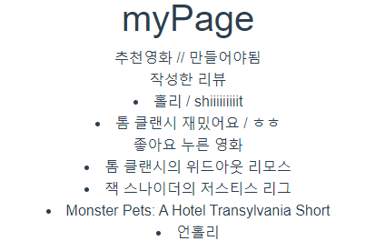

3. 추천영화

   - 새로운 페이지를 만들어서 보여주기로 함


## 영화 추천

### 1. Server

1. movies app에서 추천 알고리즘을 만들어서 보내줌
2. orm을 사용하여 db내에 있는 영화를 vote_average의 내림차순으로 받고, 10개만 보내줌 -> to10 엄선작
3. 사용자가 리뷰를 적은 영화와 비슷한 장르를 추천하는 알고리즘 -> 개인 맞춤 영화
   - 작성한 리뷰도 다시 추천하는 문제가 생겨서 리뷰를 작성한 영화는는 제거해서 보내줌

### 2. Client

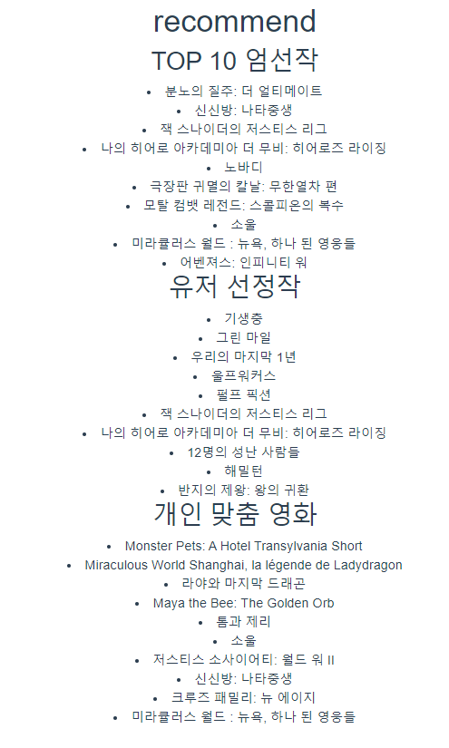

1. 추천 영화 출력
2. 유저 선정작은 tmdb의 top rated로 요청을 보내서 10개만 사용함

## 디자인

1. 반응형 Nav

   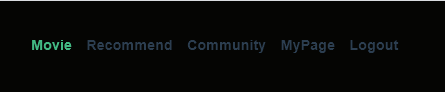

   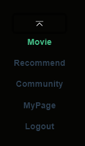

2. 영화 조회

   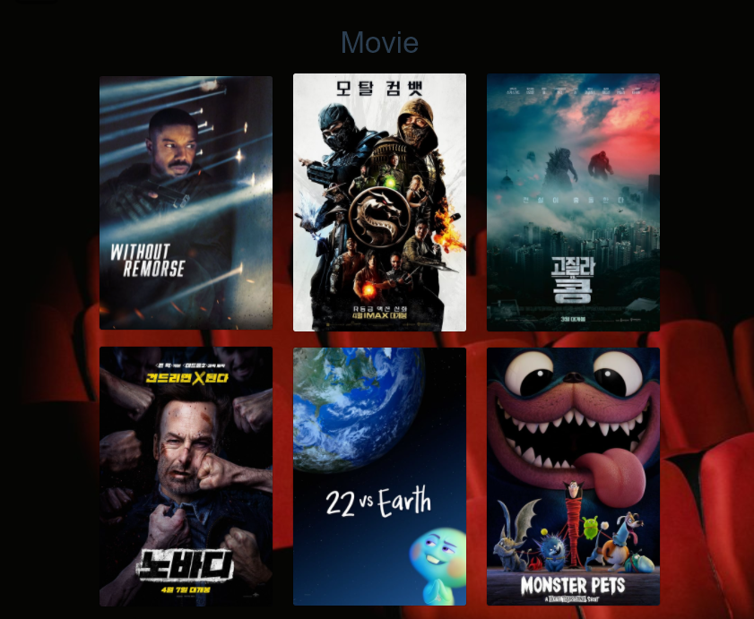

3. 영화 상세 정보

   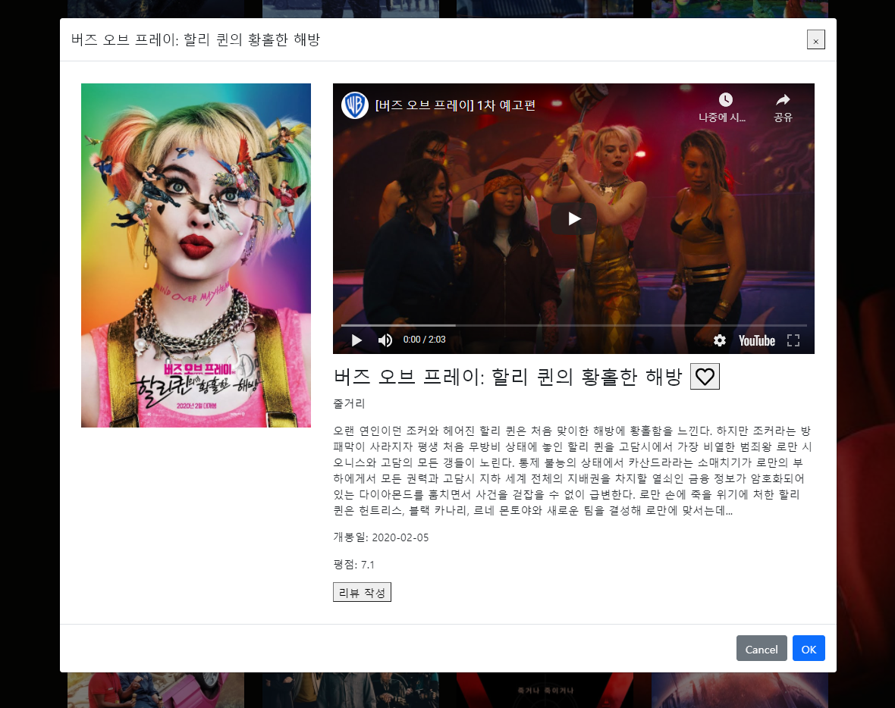

   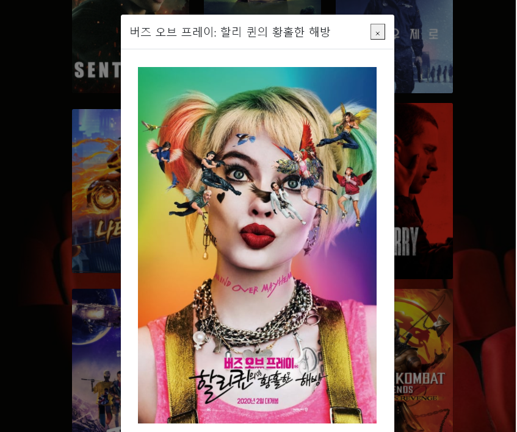

   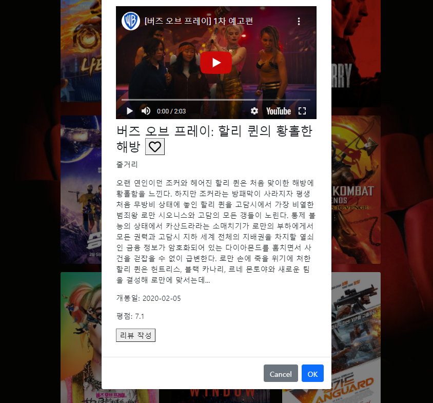

4. 리뷰 게시판(커뮤니티)

   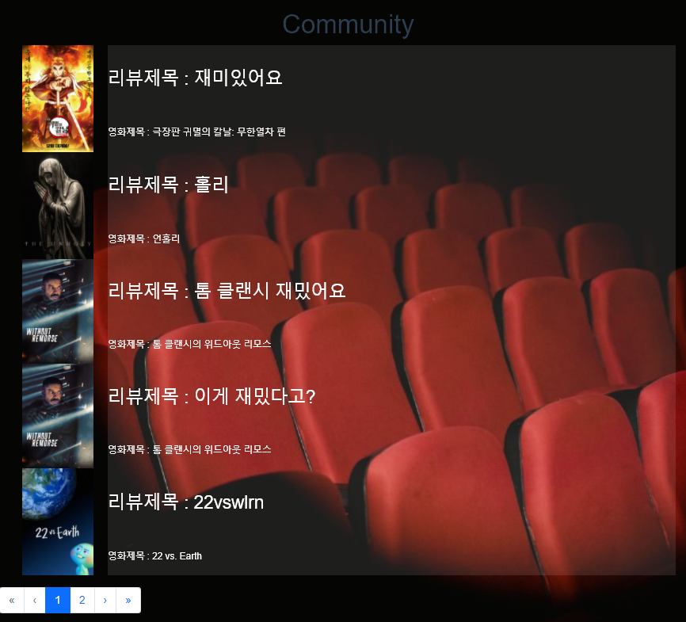

5. 마이 페이지

   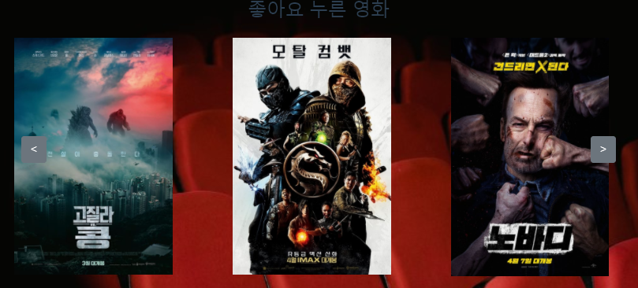

   - 카로셀 누르면 링크가 넘어가는 문제가 발생해서 다른 패키지 사용
   - 근데 패키지가 불안함

6. 로그인, 회원가입 

   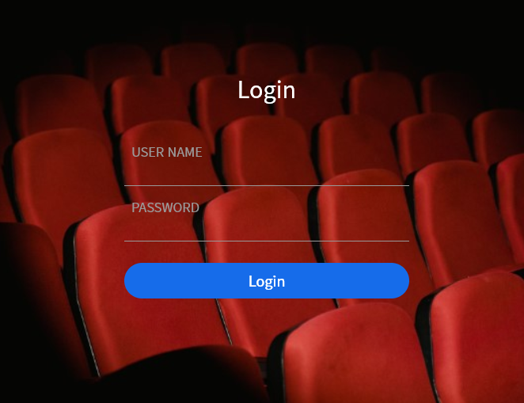

   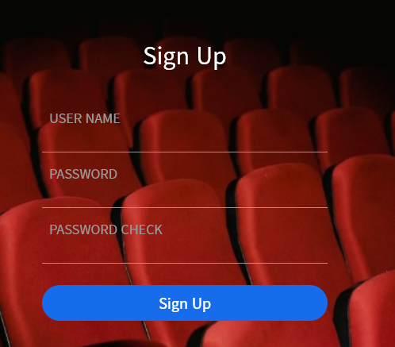


---


5/20 

1. 로그인 
백: jwt기반 로그인, 
프론트: 브라우저(로컬 저장소)에 저장, 로그인 폼
2. 회원가입
백: 커스템 유저 모델 작성, 시리얼라이저 작성, 아이디 db 저장
프론트: 회원가입 폼

3. 전체 영화리스트
백: TMDB 데이터 받아서 json으로 변환, serializer 사용해서 프론트 전달
프론트: 데이터 받아서 영화리스트 출력, bootstrap 사용(card)

4. 영화 정보 (detail)
백: X
프론트: boostrap modal 사용, 유튜브 트레일러 재생

5/21 계획

1. 영화 리뷰 / 게시글(crud) => 오전쯤
백: CRUD 구현
프론트: 디테일 페이지에 리뷰 몇개 보여주고, 작성하는 연결버튼 작성, 리뷰 작성 폼 / 리뷰만 모아놓은 페이지(게시판)

2. 개인 페이지 => 오후 쯤
    백: 시리얼라이저 -> 어떤 영화를 봤는지, 좋아요 누른 영화, 작성한 리뷰

   - 좋아요 구현
   - 모델링 생각해보기

  프론트: 개인 페이지 구성

3. admin
    백: 장고 기본 admin 페이지 
    프론트: X

---

5/21

1. 영화 리뷰

   백: api

   - 리뷰 CRUD 구현
   - 댓글 crud

   프론트: 

   - 디테일 페이지에 리뷰 작성 버튼
   - 리뷰 작성 폼
   - community(리뷰만 모아놓은 페이지)
   - 리뷰 상세 페이지 및 댓글


5/22 계획

1. 영화 리뷰

   프론트: 

   - 댓글 수정 기능 
   - 디테일 페이지에 리뷰 몇개 보여주기(리뷰 전체 보여줌, 추후에 바꿀것)

2. 개인페이지

   백: 

   - 영화 좋아요 구현
     - movie에 manyToMany field 추가
     - 마이페이지에 같이 들어갈 api 작성
   - 리뷰 좋아요 X

   프론트:

   - 디테일 페이지 좋아요 버튼
   - 개인페이지 구성
     - 좋아요 누른 영화
     - 작성한 리뷰 목록
     - 개인 추천 

---

5/22

1. 영화 리뷰

   백:

   - RESTFul API 으로 수정

   프론트: 

   - 댓글 수정 기능 : 리뷰 상세 페이지에서 JS로 구현
   - 디테일 페이지에 리뷰 몇개 보여주기

2. 개인페이지

   백: 

   - 영화 좋아요 구현
     - movie에 manyToMany field 추가
     - 마이페이지에 같이 들어갈 api 작성
   - 추천 알고리즘 작성
   
   프론트:
   
   - 디테일 페이지 좋아요 버튼
   - 개인 페이지 구성
     - 좋아요 누른 영화
     - 작성한 리뷰 목록
   - 영화 추천 페이지 구성


5/23 계획

1. 디자인 적용 및 프론트 재구성

   프론트:

   - 영화사이트처럼 조금 어두운 느낌으로하위 모델
   - 개인 페이지나 추천 페이지에서 영화를 눌렀을때 뜨는 modal분리
   
   1. Movie
   
      Card 형식 (제목 제외)
   
      마우스 오버 이벤트(클릭 하지 않고 마우스 포인터만 올렸을때 이름, 장르만 나오게)
   
      클릭하면 Modal 
   
   2. Recommend
   
      Carosel -> glide
   
      클릭시 Modal
   
      마우스 오버 이벤트(할수 있으면)
   
   3. Community
   
      게시판 느낌 
   
      - 포스터, 영화제목, 리뷰제목
   
      - 페이지네이션
   
      리뷰 작성 페이지: 심플하게
   
      상세 페이지: 심플하게
   
   4. My page
   
      작성한 리뷰
   
      - 커뮤니티 느낌
   
      좋아요 영화
   
      - carosel + modal
   

---

주말한 거

- 영화 리뷰

  백:

  - RESTFul API 으로 수정

  프론트: 

  - 댓글 수정 기능 : 리뷰 상세 페이지에서 JS로 구현
  - 디테일 페이지에 리뷰 몇개 보여주기

- 개인페이지

  백: 

  - 영화 좋아요 구현
    - movie에 manyToMany field 추가
    - 마이페이지에 같이 들어갈 api 작성
  - 추천 알고리즘 작성

  프론트:

  - 디테일 페이지 좋아요 버튼
  - 개인 페이지 구성
    - 좋아요 누른 영화
    - 작성한 리뷰 목록
  - 영화 추천 페이지 구성

- 디자인 적용 및 프론트 재구성

  - 배경 사진 삽입
- Community(게시판 느낌 )
  
  - 포스터, 영화제목, 리뷰제목
  
    - 페이지네이션

  - 개인 페이지나 추천 페이지에서 영화를 눌렀을때 뜨는 modal분리


5/24 계획

- 상세 페이지: 심플하게, 평점추가, 댓글 디자인
- 리뷰 작성 페이지: 심플하게, 평점 추가
- myPage

- Movie: 마우스 오버 이벤트(Hover/ 클릭 하지 않고 마우스 포인터만 올렸을때 이름, 장르만 나오게)
  - [참고](https://css-tricks.com/how-to-re-create-a-nifty-netflix-animation-in-css/)

- carousel 직접 구현(하는중)


모달 내 디자인/ nav 디자인(글씨 밝게) / signup,로그인 배경 선정

합치기


---

일요일: 프론트, 디자인

- 넷플릭스, 왓차를 보면서 얘네 구조는 어떻게 생겼는지 확인
- Card, Modal 분리함

월: 프론트, 디자인, 중간 점검

- 리뷰에 평점추가

화: 프론트 디자인 완성

수: 영상 필요하면 이때까지 완성, PPT

목: PPT

금: 발표

